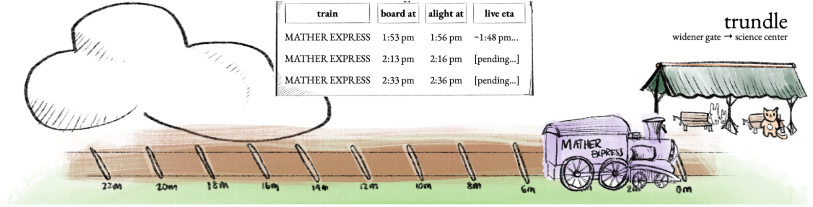

**Trundle**

An interface for the Harvard shuttle system that leverages abstraction and lovely hand-drawn art to allow you immediate access to the information you need most: what’s coming, how soon, and how certain it is!

**Tell-All**:
[Project Paper](trundle.pdf)

**Features from a Glance**
* **Visual Timeline**: Train tracks of transverse bars mark two-minute intervals, helping users understand the urgency of their choices at a glance
* **Depiction of Uncertainty**: Each suggestion is shown as a watercolor train on the timeline, providing tangible visual intuition of the travel options
* **Live Shuttle ETA Suggestions**: Real-time updates are calculated from shuttle arrival times
* **User-Friendly Interface**: Distraction-free design conveys information effectively and efficiently

**Citing...**

Harvard’s CS178: Engineering Usable Interactive Systems  Professor Elena Glassman

When(ish) is My Bus? User-centered Visualizations of Uncertainty in Everyday, Mobile Predictive Systems
Matthew Kay, Tara Kola, Jessica R. Hullman, Sean A. Munson.
Presented at the Conference on Human Factors in Computing Systems (CHI), 2016.

**Video Demo**

By Kyra Mo and Patrick Thornton
